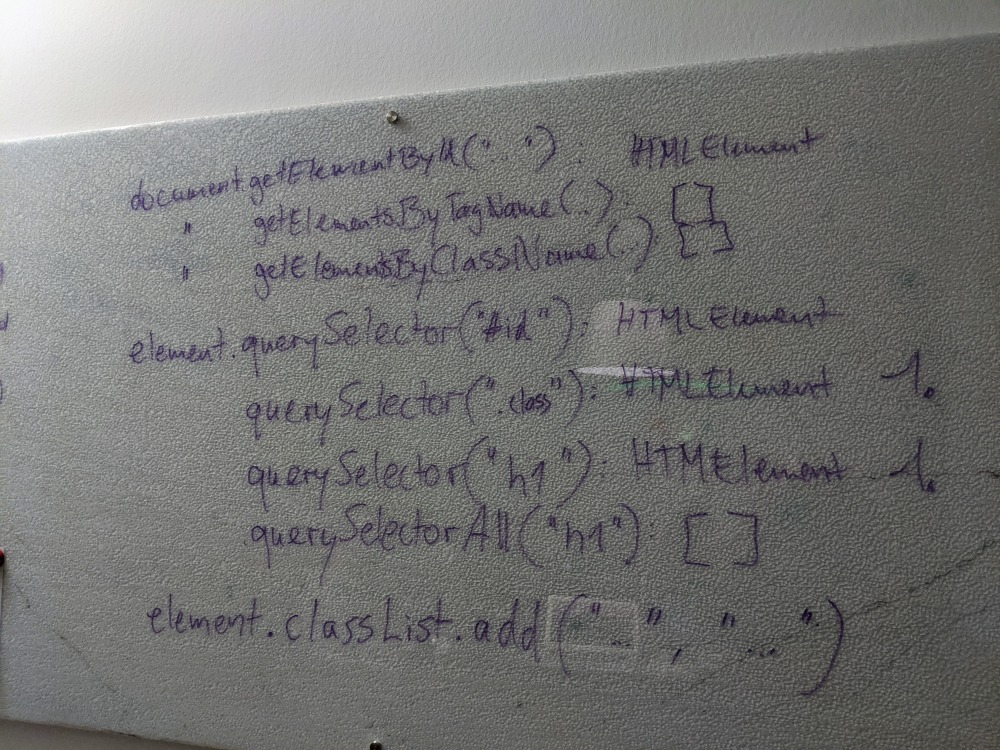
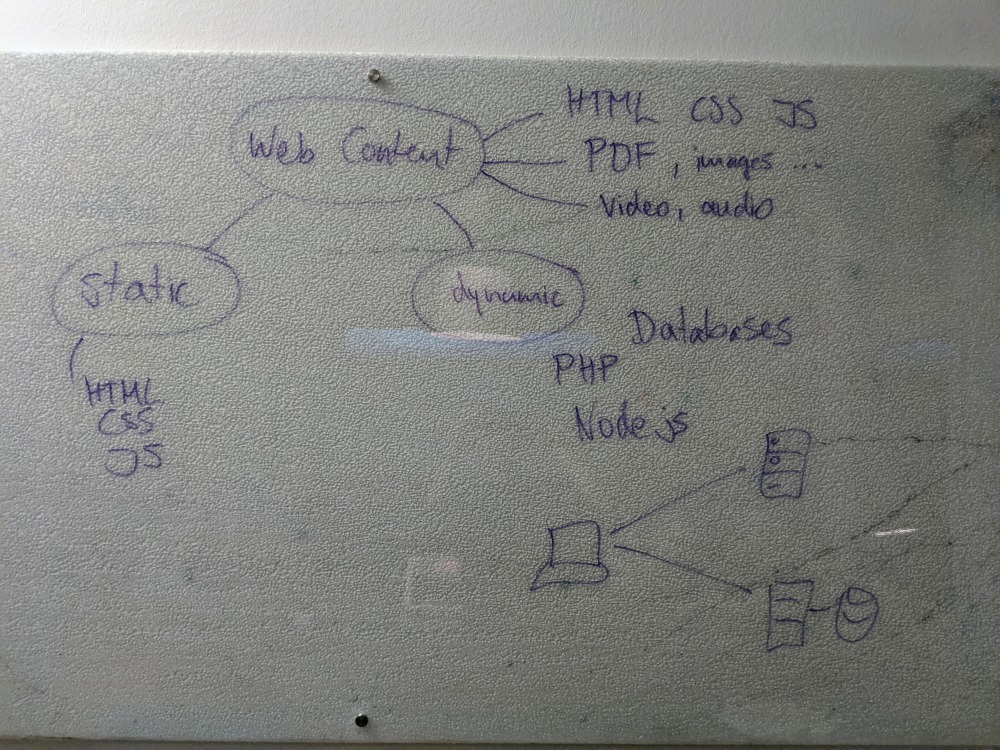
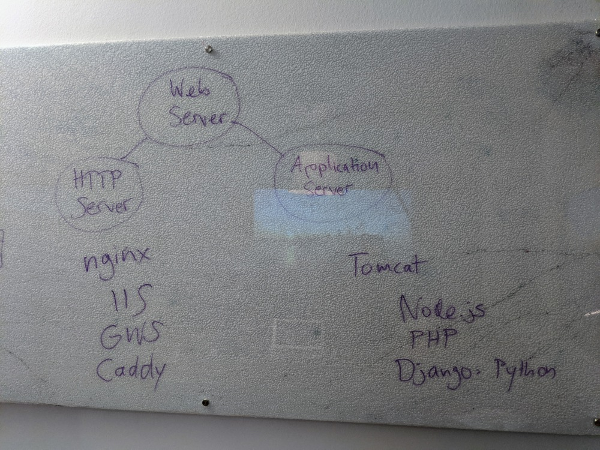
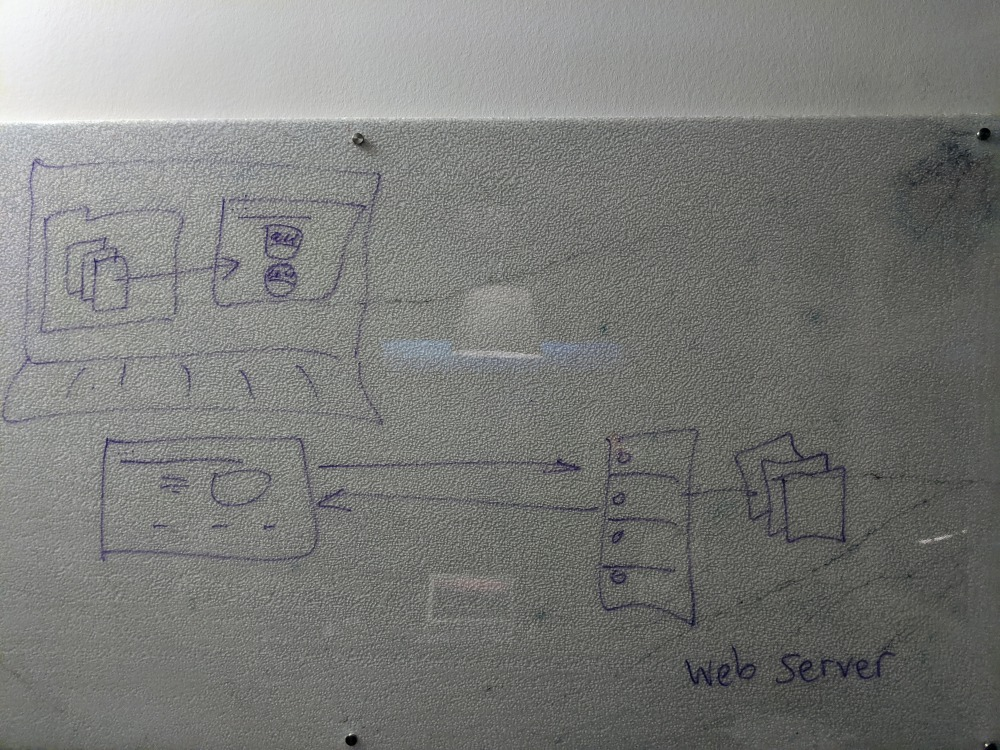
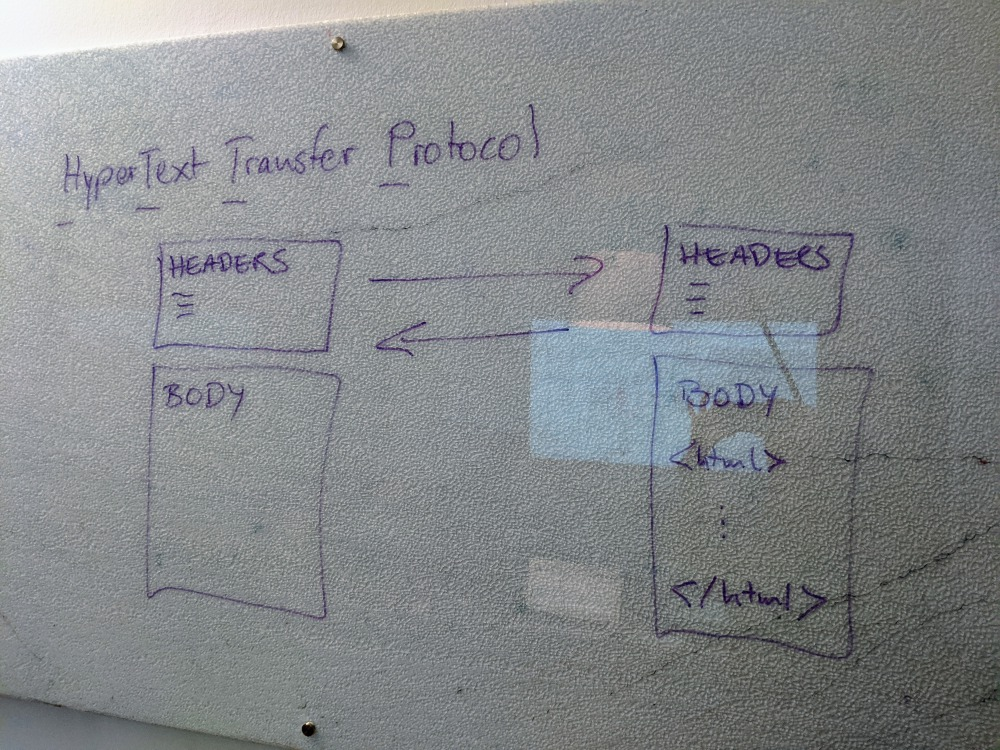
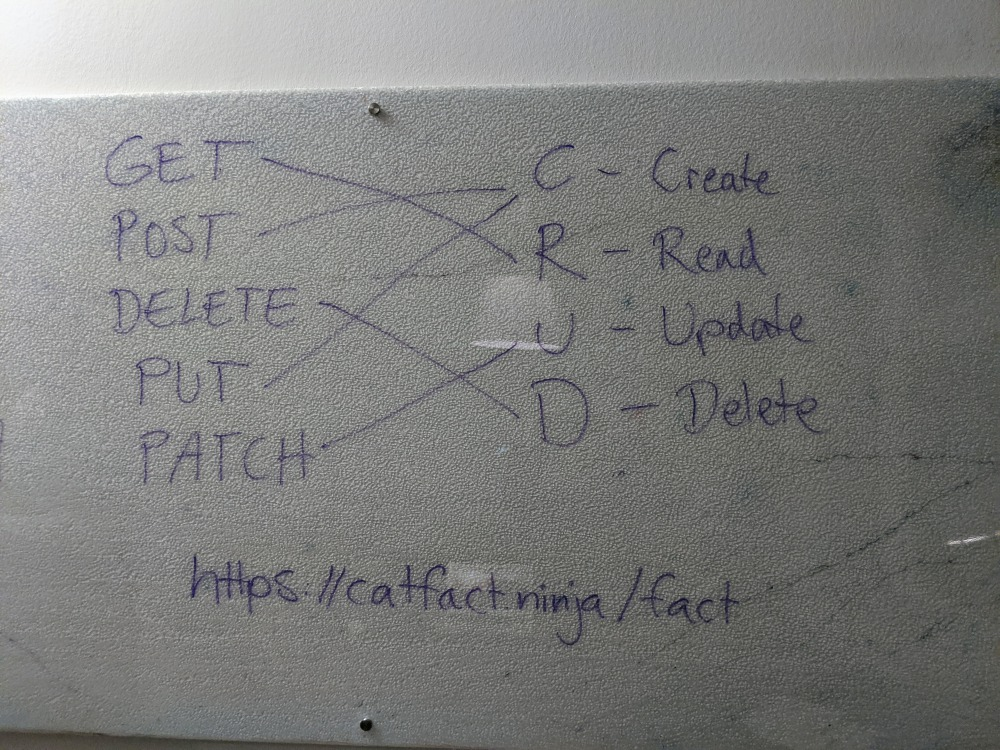
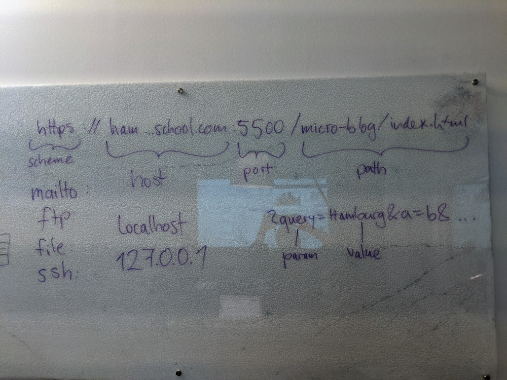

# Javascript for Web 2020-03
Course material and example project for the course JavaScript for Web, March 2020.

Tailwind: https://tailwindcss.com/

## Session 1

JSON
- https://www.json.org/json-en.html
- JSON.parse() and JSON.stringify(): https://alligator.io/js/json-parse-stringify

DOM
- https://www.w3schools.com/js/js_htmldom.asp
- getElementById(): https://www.w3schools.com/jsref/met_document_getelementbyid.asp
- querySelector(): https://www.w3schools.com/jsref/met_element_queryselector.asp
- Tutorial: https://dev.to/iqramqra/a-beginners-guide-to-dom-manipulation-45bk
- Adding classes: https://alligator.io/js/classlist/

## Session 2

`let` and `const`
- const: http://es6-features.org/#Constants
- let: http://es6-features.org/#BlockScopedVariables
- For the know-it-all: https://medium.com/javascript-scene/javascript-es6-var-let-or-const-ba58b8dcde75

Template Literals
- https://developer.mozilla.org/en-US/docs/Web/JavaScript/Reference/Template_literals

Fat Arrow Functions
- https://www.w3schools.com/Js/js_arrow_function.asp

DOM Functions

`document.getElementById("...")` : HTML Element  
`document.getElementsByTagName("...")` : []  
`document.getElementsByClassName("...")` : []

`someElement.querySelector("#idname")` : 1. HTML Element  
`someElement.querySelector(".classname")` : 1. HTML ELement  
`someElement.querySelector("tagname")` : 1. HTML Element  
`someElement.querySelectorAll("...")` : []  

`someElement.classList.add("class1", "class2", "someotherclass")`  

## Session 3

Web Content

Web Server

Local Web Server
- VS Code:  
  Extensions > Live Server > install  
  index.html > Open with Live Server
- Atom:  
  Packages > Settings View > Install Packages / Themes > atom-live-server > install  
  Packages > atom-live-server > Start server

HTTP
- https://www.youtube.com/watch?v=iYM2zFP3Zn0

HTTP Methods

CRUD: Create - Read - Update - Delete

URLs

## Session 4

REST APIs:
- https://www.programmableweb.com/api-university/what-are-apis-and-how-do-they-work
- https://www.smashingmagazine.com/2018/01/understanding-using-rest-api/
  
Cat Fact API:
- https://catfact.ninja/
- `https://catfact.ninja/fact`

Punk API (beers):
- https://punkapi.com/documentation/v2
- `https://api.punkapi.com/v2/beers`

## Session 5

Open Weather API:
- https://openweathermap.org/current
- `api.openweathermap.org/data/2.5/weather?q=Hamburg&appid=...`

## Session 6

Discogs API:
- https://www.discogs.com/
- https://www.discogs.com/developers

CORS:
- https://javascript.info/fetch-crossorigin
- https://javascript.info/fetch-api
- https://developer.mozilla.org/en-US/docs/Web/HTTP/CORS

Firebase:
- Console: https://console.firebase.google.com/u/0/?pli=1
- Add Firebase to web project: https://firebase.google.com/docs/web/setup
- Firestore Quickstart: https://firebase.google.com/docs/firestore/quickstart
- Read data: https://firebase.google.com/docs/firestore/quickstart#read_data
- Add data: https://firebase.google.com/docs/firestore/quickstart#add_data

## Session 7

Date and Time:
- `let now = new Date();`
- `now.toString()`
- `now.toDateString()`
- https://codehandbook.org/javascript-date-format/
- https://javascript.info/date
- https://firebase.google.com/docs/reference/js/firebase.firestore.Timestamp/

Google Maps API:
- https://cloud.google.com/maps-platform/
- Google Cloud Console: https://console.cloud.google.com/
- Maps JavaScript API Documentation: https://developers.google.com/maps/documentation/javascript/tutorial?hl=en_US

`async` & `defer`:
- https://javascript.info/script-async-defer

Geolocations:
- https://www.latlong.net/

Firebase Storage:
- https://firebase.google.com/docs/storage/web/start
